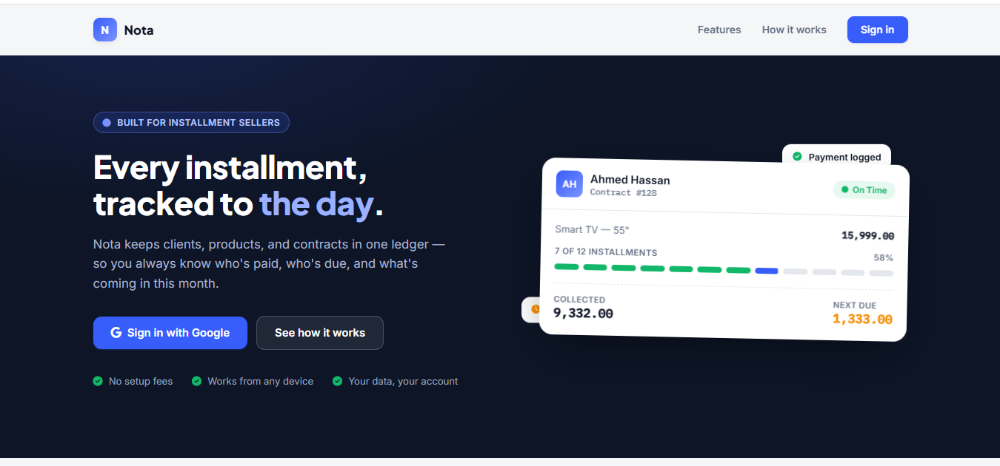
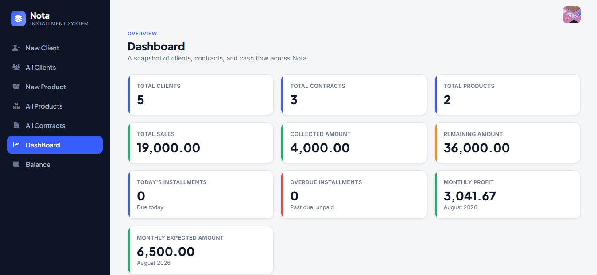
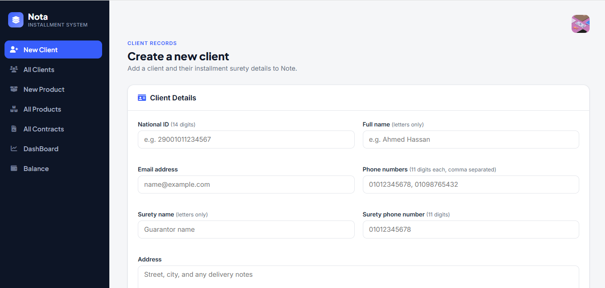
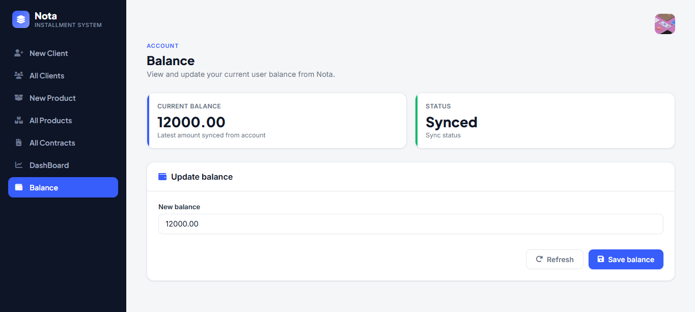

# 💳 Nota — Installment Management System

An installment management system that helps business owners manage clients, products, and installment contracts in one place, track payments and outstanding balances, and monitor overall sales and profit through a live dashboard.


---

## 📖 Overview

Business owners who sell on installment plans often track clients, products, contracts, and payments manually. This makes it difficult to know who owes what, which installments are due or overdue, and how the business is performing overall.

**Nota** replaces this manual tracking with a single, consistent system — letting the user manage clients, products, and contracts, search for clients and products, record payments, and automatically track their available balance, all from one dashboard.

---

## ✨ Features

### 🔐 Secure Authentication
- Sign up and log in securely
- Hashed credentials and validation mechanism

### 👥 Client Management
- Add, edit, delete, and view clients
- Dedicated clients admin page connected to the database

### 📦 Product Management
- Add, edit, delete, and view products
- Dedicated products admin page connected to the database

### 🔍 Search
- Search mechanism for clients
- Search mechanism for products

### 💰 Balance Management
- Set your balance at sign-up
- Edit or top up your balance at any time
- Balance stored and tracked automatically

### 📄 Contract Management
- Add, edit, delete, and view contracts linking clients and products
- Balance check before allowing contract creation
- Balance decreases automatically by the contract's remaining amount

### 💵 Payments & Balance Tracking
- Record payments a client makes against a contract
- Edit existing payment records
- Balance increases automatically when a payment is recorded

### 📊 Dashboard
- Total clients, products, and contracts
- Sales, collected amount, and remaining amount
- Installments due today and overdue installments
- Monthly profit and expected amount

---

## 📸 Application Preview

| Home Page | Dashboard |
|---|---|
|  |  |

| Create Client | Balance |
|---|---|
|  |  |

---

## 🛠 Technology Stack

| Category | Technologies |
|---|---|
| **Backend** | Python, FastAPI |
| **Database** | Supabase (PostgreSQL) |
| **Frontend** | HTML5, CSS3, JavaScript |
| **Security** | Hashed credentials, request validation |

---

## 🏛 Architecture

Nota follows **Clean Architecture** principles to keep the codebase organized, testable, and easy to maintain as it grows. Each layer has a single responsibility and depends only on the layers beneath it — business logic stays independent from frameworks, databases, and UI details.

```
app/
│
├── domain/            # Core business rules — entities, value objects, and interfaces. No external dependencies.
├── application/        # Use cases / business logic that orchestrates the domain layer.
├── infrastructure/     # Implementation details — database (Supabase), external services, repositories.
└── presentation/        # API routes, request/response models, and UI-facing logic (FastAPI).
```

**Why Clean Architecture?**
- 🔄 Business logic is decoupled from FastAPI and Supabase — either can be swapped with minimal impact
- 🧪 Core domain logic can be tested in isolation, without a database or web server
- 📦 Clear boundaries make the codebase easier to navigate and extend as features grow

---

## 🚀 Getting Started

### Prerequisites
- Python 3.11+
- A [Supabase](https://supabase.com/) project (URL + API key)
- pip / virtualenv

### Installation

```bash
git clone https://github.com/<your-username>/nota.git
cd nota
```

Create a virtual environment and install dependencies:

```bash
python -m venv venv
source venv/bin/activate   # On Windows: venv\Scripts\activate

pip install -r requirements.txt
```

Create a `.env` file:

```env
SUPABASE_URL=YOUR_SUPABASE_URL
SUPABASE_KEY=YOUR_SUPABASE_API_KEY
SECRET_KEY=YOUR_SECRET_KEY
```

> ⚠️ Never commit your `.env` file or API keys to GitHub.

Run locally:

```bash
uvicorn main:app --reload
```

The app will be available at `http://127.0.0.1:8000`

---

## 📂 Project Structure

```
nota/
│
├── main.py
├── requirements.txt
├── LICENSE
├── app/
│   ├── domain/
│   ├── application/
│   ├── infrastructure/
│   └── presentation/
│
├── screenshots/
│   ├── home_page.PNG
│   ├── dashboard.PNG
│   ├── create_client.PNG
│   └── balance.PNG
│
├── docs/
│   ├── Nota_Brief.pdf
│   ├── Nota_BRD.pdf
│   ├── Nota_PRD.pdf
│   └── Nota_action_plan.pdf
│
└── README.md
```

---

## 📄 Documentation

The complete project documentation is available in the [`docs`](docs) folder.

- 📘 [Project Brief](docs/Nota_Brief.pdf)
- 📗 [Business Requirements Document (BRD)](docs/Nota_BRD.pdf)
- 📙 [Product Requirements Document (PRD)](docs/Nota_PRD.pdf)
- 📕 [Action Plan](docs/Nota_action_plan.pdf)

---

## 📜 License

This project was developed for educational and academic purposes. No license has been specified at this time.

---

⭐ If you found this project interesting, consider giving it a star!

Built with ❤️ using Python, FastAPI, Supabase, HTML, CSS, and JavaScript
